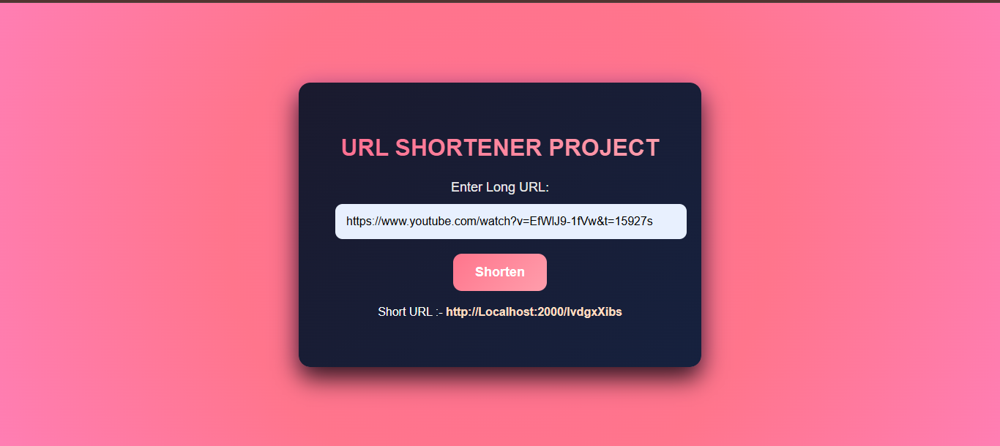

# 🚀 URL Shortener - Full Stack Web Application



A professional and responsive URL Shortener application built using the **MERN** stack (MongoDB, Express, Node.js). This application transforms long URLs into unique, short, and shareable links that redirect to the original destination.

---

## ✨ Features

* **URL Shortening**: Generates unique short codes using the `shortid` library.
* **Instant Redirection**: Automatically redirects users from the short link to the original long URL.
* **Persistent Storage**: Securely stores URL mappings in **MongoDB** database.
* **Modern UI**: An interactive frontend with neon-glow animations and a responsive design.
* **Real-time Results**: Displays the generated short link immediately on the page.

---

## 🛠️ Technical Stack & Packages

### **Backend & Logic**
* **Node.js**: The runtime environment for the server.
* **Express.js**: Web framework used for routing and handling requests.
* **Mongoose**: The ODM library used to interact with MongoDB.
* **Shortid**: Used for creating non-sequential, unique IDs for the short URLs.

### **Frontend**
* **EJS (Embedded JavaScript)**: Used as the view engine to render dynamic HTML.
* **CSS3**: Custom animations (`glowPulse`, `fadeIn`) and modern neon styling.

### **Database Management**
* **MongoDB Compass**: Used as the GUI for managing the `project1` database and collections.

---

## 📂 Project Structure

* `server.js`: The main entry point that configures the Express server and database connection.
* `Models/Url.js`: Contains the Mongoose schema for `shortCode` and `longUrl`.
* `Controllers/url.js`: Contains the logic for shortening URLs and redirection.
* `views/index.ejs`: The user interface where users interact with the app.

---

## 🚀 Installation & Setup

1.  **Clone the Repository**
    ```bash
    git clone [https://github.com/tayyabrehan/URL-Shortener---Full-Stack-Web-Application.git](https://github.com/tayyabrehan/URL-Shortener---Full-Stack-Web-Application.git)
    cd first-project
    ```

2.  **Install Dependencies**
    ```bash
    npm install
    ```

3.  **Database Connection (MongoDB Compass)**
    * Connect to your instance via **MongoDB Compass**.
    * The application uses the `project1` database as configured in `server.js`.

4.  **Run the Server**
    ```bash
    # Using Nodemon for development
    npx nodemon server.js

    # Using Standard Node
    node server.js
    ```

5.  **Access the Application**
    Open `http://localhost:2000` in your browser.

---

## 📝 License
This project is licensed under the **ISC License**.
